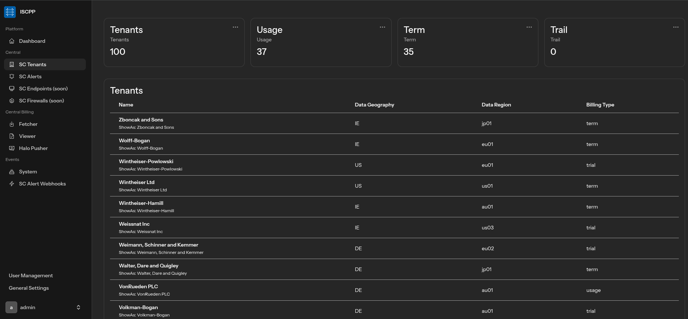

# ISCPP - Improved Sophos Central Partner Center
This project aims to leverage the Sophos Central API to develop a tool that addresses some missing features that could benefit MSPs. 
Additionally, it seeks to integrate with PSA systems to enhance billing processes.

This is software is still in alpha, but have passed some first live tests.
Thanks to the testers and there feedback.
I understand there is still much work to be done, but I wanted to release ISCPP to allow users to start benefiting from its features and provide valuable feedback. Your input will help shape the future of this project and ensure it meets the needs of its users effectively.


## Fast overview over alle tenants



## Webhooks for Sophos Central Alerts


## Sophos Central Billing Integration for Halo


Halo Monthly Usage can be imported via the pusher

> Currently this is a two click two step process. First fetch the data from Sophos Central, then push it to halo. I want to make it zero clicks in the future.

## Alot for to come

Please be patient, i got lots of ideas ;)

## Who am i
I am a senior technician at a German MSP with a passion for automation and programming. 
Please note that I am not affiliated with Sophos, Halo, or NinjaRMM.

This project is a personal endeavor, and while I strive to ensure the application is secure and reliable to the best of my abilities and knowledge, I cannot accept liability for any misuse or issues that may arise.

## Plans

I have a lot of ideas and a small amount of time.
The current state of the project is an alpha and use at your own risk.
At that point in time i cannot give any paid support or promised.
I give my best to look at you problems.

Please feel free to open any issue or ping me on discord with ideas.

### Current Target

- Alert webhooks for PSA Systems
- Fast an quick overview of Tenant Health Scores
- Fast an quick search for Endpoint and current status
- Halo PSA > Billing Integration - Push Billing Data to Subscription
- Halo PSA > Client Matching for Billing
- Good Documentation for first setup

### Future Targes

- Polish UI
- NinjaRMM > Endpoint Matching
- NinjaRMM > Sophos Endpoint Installation
- Halo PSA > Endpoint Matching
- Sophos > Firewall Mass Update Scheduling

# Installation on Laravel Cloud

Laravel Cloud is the easiest method to deploy ISCPP.

1. Create or login to your account on github.com and Fork this repository. (The fork is currently needed, because Laravel Cloud can only use own repositories)
2. Create or login to cloud.laravel.com
3. `New Application` and choose the forked repository
4. Add `Posgres 17` database
5. Click on the CPU Worker and enable `Scheduler` and add `php artisan queue:work database` as background job
6. Click deploy
7. Go do Settings > Deployment and add:
```
npm install
npm run build
```
8. Done - Check Settings > Domains for access

> I am currently not able to host instances for you, i will investigate that in the future.

# Local Installation

This is a PHP Laravel Application with Postgres as backend and based on the Laravel 12 Livewire starterkit. 
I target to be fully compatible with laravel cloud, for as easy as possible setup.

The following jobs need to run in the background:

```
php artisan schedule:run
php artisan queue:work

```

I am planning on creating a detailed doc on how to setup the application with laravel cloud as soon as the Multiuser is implemneted.

As long you can setup a local environment pretty use.
This is not the perfect way to do it. Just a quick one. If you have anything which can host laravel application go with that :)

1. Setup an Postgres, PHP, Compser, NPM
2. Clone the Github Reposoitory
3. Clone the .env.example to .env and fill it
4. run `php artisan migrate`
5. run `composer install`
6. run `php artisan key:generate`
7. run `php artisan optimize`

## Quick Local Testing

Run those commands in 3 terminals:


```
composer run dev
```

```
composer schedule:work
```

```
composer queue:listen
```

## Run as Server

Setup a cron or planned task to run the needed jobs in the background every minute

```
php artisan schedule:run
```

Setup a Task wich autostarts if fails with this

```
php artisan queue:work
```

Setup a Task wich autostarts if fails with this

```
php artisan serve
```

# First Setup

On the initial setup, when no user exist the login route gets forwarded to the register route.
This route is disabled after the first user is added.

Setup your Sophos Central Cerdentials in The `General Settings`

Look around :)

> Make sure your `Jobs in Queue` counter on the dashboard ticks down. This is done with the background jobs.
> Everything is syncronized in the background, so you do not see "live" data. Depending on your environment, it can take amoment to catch up.
